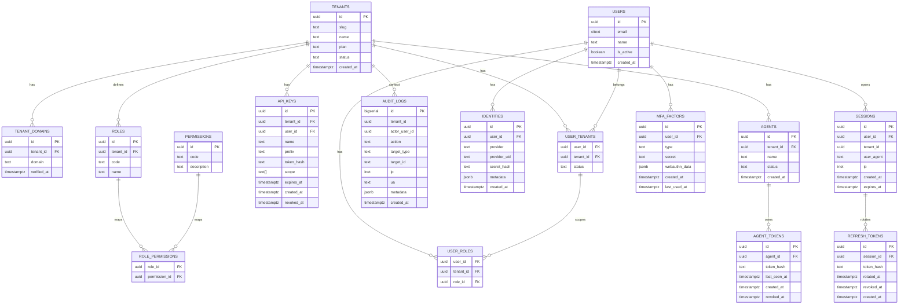

**ERD (Auth/RBAC/Multi‑Tenant)**

```mermaid
erDiagram
  TENANTS ||--o{ TENANT_DOMAINS : has
  TENANTS ||--o{ ROLES : defines
  TENANTS ||--o{ USER_TENANTS : has
  TENANTS ||--o{ API_KEYS : has
  TENANTS ||--o{ AGENTS : has
  TENANTS ||--o{ AUDIT_LOGS : context

  USERS ||--o{ IDENTITIES : has
  USERS ||--o{ USER_TENANTS : belongs
  USERS ||--o{ USER_ROLES : has
  USERS ||--o{ SESSIONS : opens
  USERS ||--o{ MFA_FACTORS : has

  ROLES ||--o{ ROLE_PERMISSIONS : maps
  PERMISSIONS ||--o{ ROLE_PERMISSIONS : maps
  USER_TENANTS ||--o{ USER_ROLES : scopes

  SESSIONS ||--o{ REFRESH_TOKENS : rotates
  AGENTS ||--o{ AGENT_TOKENS : owns

  TENANTS {
    uuid id PK
    text slug
    text name
    text plan
    text status
    timestamptz created_at
  }
  TENANT_DOMAINS {
    uuid id PK
    uuid tenant_id FK
    text domain
    timestamptz verified_at
  }
  USERS {
    uuid id PK
    citext email
    text name
    boolean is_active
    timestamptz created_at
  }
  IDENTITIES {
    uuid id PK
    uuid user_id FK
    text provider
    text provider_uid
    text secret_hash
    jsonb metadata
    timestamptz created_at
  }
  USER_TENANTS {
    uuid user_id FK
    uuid tenant_id FK
    text status
  }
  ROLES {
    uuid id PK
    uuid tenant_id FK
    text code
    text name
  }
  PERMISSIONS {
    uuid id PK
    text code
    text description
  }
  ROLE_PERMISSIONS {
    uuid role_id FK
    uuid permission_id FK
  }
  USER_ROLES {
    uuid user_id FK
    uuid tenant_id FK
    uuid role_id FK
  }
  SESSIONS {
    uuid id PK
    uuid user_id FK
    uuid tenant_id
    text user_agent
    inet ip
    timestamptz created_at
    timestamptz expires_at
  }
  REFRESH_TOKENS {
    uuid id PK
    uuid session_id FK
    text token_hash
    timestamptz rotated_at
    timestamptz revoked_at
    timestamptz created_at
  }
  MFA_FACTORS {
    uuid id PK
    uuid user_id FK
    text type
    text secret
    jsonb webauthn_data
    timestamptz created_at
    timestamptz last_used_at
  }
  API_KEYS {
    uuid id PK
    uuid tenant_id FK
    uuid user_id FK
    text name
    text prefix
    text token_hash
    text[] scope
    timestamptz expires_at
    timestamptz created_at
    timestamptz revoked_at
  }
  AGENTS {
    uuid id PK
    uuid tenant_id FK
    text name
    text status
    timestamptz created_at
  }
  AGENT_TOKENS {
    uuid id PK
    uuid agent_id FK
    text token_hash
    timestamptz last_seen_at
    timestamptz created_at
    timestamptz revoked_at
  }
  AUDIT_LOGS {
    bigserial id PK
    uuid tenant_id
    uuid actor_user_id
    text action
    text target_type
    text target_id
    inet ip
    text ua
    jsonb metadata
    timestamptz created_at
  }
```

